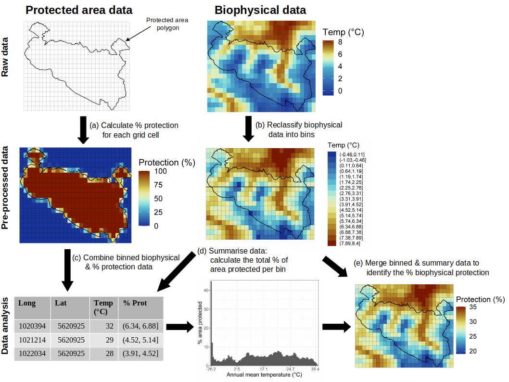
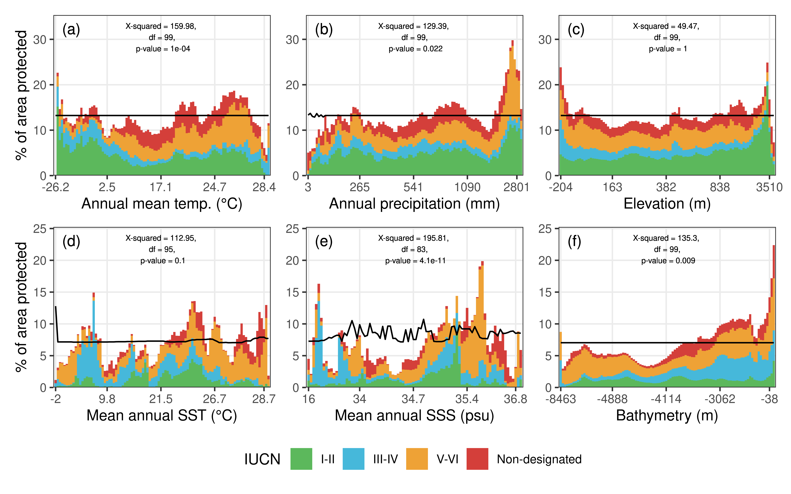

Representation of the world’s biophysical conditions by the global
protected area network
================

**Running head:** Global protection of abiotic conditions

## Abstract

Protected areas (PAs) are one of the most effective ways to conserve
biodiversity and have been steadily growing in number and overall areal
extent. Yet, individual PAs are still mostly small and unconnected and
are often implemented without consideration of already existing PAs.
This is likely to cause an over-representation of certain biophysical
conditions within the PA network, which may in turn weaken their overall
potential to conserve biodiversity, and could potentially exacerbate
under future climate change. Here, we assess the representativeness of
the world’s biophysical conditions by the current global PA network,
highlighting which conditions are currently under-protected and where
these conditions are located. Quantifying the protection coverage of
biophysical conditions, we found that for the terrestrial realm, high
temperature and low precipitation conditions as well as medium and very
high elevational levels were underrepresented, while for the marine
realm, different levels of salinity, sea surface temperature and
particularly the deep sea were underrepresented. Overall, the protection
of terrestrial conditions was evenly distributed for elevation, while
for the marine realm sea surface temperature (SST) was evenly
distributed. Terrestrial environments that are both cold and very dry as
well as discrete SST and SSS conditions across most depths had mostly
low protection. Low-protected conditions mostly occurred in the Sahara
and the Arabian Peninsula for the terrestrial realm and along the Tropic
of Capricorn and towards the poles for the marine realm. While
biodiversity measures are of prime importance for PA planning
strategies, our study adds a frequently overlooked perspective by
highlighting potential biophysical gaps in the current global PA
network. This may provide additional useful insights for researchers,
conservation practitioners as well as policy makers in order to improve
prioritization efforts for a more comprehensive PA system globally.

**Keywords:** temperature, precipitation, salinity, elevation,
bathymetry, marine, terrestrial, abiotic conditions

## INTRODUCTION

Anthropogenic impacts on biodiversity often vary between land and ocean
as well as across different parts of the world, thus requiring different
conservation priorities for mitigation (Bowler et al. 2020). Yet, in
situ conservation is recognized as a fundamental requirement to maintain
biodiversity, with protected areas (PAs) being the most effective tool
(Chape et al. 2005). PAs are crucial for reducing habitat loss (Geldmann
et al. 2013), safeguarding biodiversity and conserving the provisioning
of ecosystem services (Stolton & Dudley 2010). Subsequently, PAs have
often become the last stronghold for many endangered species (Pacifici
et al. 2020).

As a result, the global PA network has been steadily growing in number
and areal extent over the last 50 years, which confirms the recognition
by governments to conserve the planet’s natural ecosystems. The
Convention on Biological Diversity (CBD) has set the target (Aichi’s
Biodiversity Target 11) to protect at least 17% of terrestrial and
inland water and 10% of coastal and marine areas by 2020 in order to
improve the status of biodiversity (CBD 2011,
<http://www.cbd.int/sp/targets>) and as of July 2018, around 14.9% of
terrestrial areas and inland waters, 16.8% of coastal and marine areas
within national jurisdiction and 1.2% of the global ocean (areas beyond
national jurisdiction) were covered by PAs (UNEP-WCMC, IUCN & NGS 2018).
Aichi Target 11 calls for the PA coverage to be ecologically
representative (CBD 2011), recommending a focus on the coverage of
ecoregions. Whilst this is likely to enhance the coverage of unique
ecological communities, it is not equal to the representativeness of
species or other biological properties at even lower spatial scales
(Visconti et al. 2019). Over the last decade, various strategies, aiming
to enhance the ecological representation of PAs, have been developed.
They range from focusing on the coverage of genetic traits (Pollock et
al. 2017), groups of individual species (i.e. species of conservation
concern; Venter et al. 2014) or the protection of mountain biodiversity
(Rodriguez-Rodriguez et al. 2011), to wider aspects including the
maintenance of ecosystem functions (Harvey et al. 2017).

Accounting for future direct and indirect impacts of climate change is
another aspect that is becoming increasingly important in conservation
planning, and various spatial prioritization approaches incorporating
potential impacts have been developed (Jones et al 2015; Maxwell et al
2020). With regard to climate change, especially the representation of
the climatic space covered by the PA network will increase in its
importance. Protecting a representative set of current abiotic
conditions is likely to provide the required diversity of environments
to support biodiversity under future climate (Ackerly et al. 2010;
Anderson & Ferree 2010; Beier & Brost 2010) and the evenness of climatic
representation under protection has been found to positively influence
the representation of climatic conditions under climate change (Elsen et
al. 2020). Overall, given that nature is often considered as a
continuous gradient of biophysical conditions, rather than based on a
set of discrete units (from vegetation types to realms), evaluating the
representativeness of nature in PA networks using biophysical gradients
has great potential. It further allows to forecast scenarios of
representativeness in the face of future climate change (Elsen et
al. 2020) and to assess other factors according to particular spatial,
temporal, and conceptual scales (Joppa & Pfaff 2009; Baldi et al. 2017,
2019).

The representation of climatic and topographic conditions across
terrestrial protected areas (TPAs) has been assessed at various spatial
scales, ranging from local to global (Rouget et al. 2003; Joppa & Pfaff
2009; Batllori et al. 2014; Monahan & Fisichelli 2014; Elsen et
al. 2018; Wang et al. 2018). Baldi et al. (2017, 2019) additionally
included the representation of human and biological factors, while Sarey
et al. (2020) assessed the representation of terrestrial ecosystems. On
the contrary, the representation of biophysical conditions across marine
protected areas (MPAs) has been less studied (but see Devillers et
al. 2015; Roberts et al. 2019) and to our knowledge so far no study has
looked at the biophysical representativeness of MPAs at a global scale.

Here, we build upon this previous work by investigating and comparing
the global protection of terrestrial and marine PAs with respect to
various biophysical factors (temperature, precipitation and topography
as well as sea surface temperature (SST), sea surface salinity (SSS) and
bathymetry, respectively) at a spatial resolution of 30 arc-seconds. We
compare different protection categories, as PAs with a low-protection
category (e.g. IUCN categories IV to VI) have only limited restrictions
on resource exploitation (Shafer, 2015). We specifically test how evenly
the biophysical conditions are currently covered by PAs and under which
conditions protection coverage is lower than expected considering
various protection categories. In addition, we analyze which biophysical
conditions are more evenly represented by terrestrial or marine PAs and
assess where the protection of certain conditions is located.

## Methods

### Protected areas

Global PA data were derived from the World Database on Protected Areas
(<https://protectedplanet.net>; IUCN & UN Environment Programme 2020)
and contained polygon data for 225,098 PAs (208,796 terrestrial, 10,724
coastal, 5,578 marine, see Supporting Information Fig. S1). We excluded
PAs for which only point information is available (21,250 PAs, see
Supporting Information Fig. S2), as these only provide information on
their overall spatial position and areal coverage, but not on their
precise spatial distribution, as required for our analysis. The PA data
were split into marine (coastal and marine) and terrestrial (coastal and
terrestrial) PAs and then further divided into four protection
categories (IUCN categories Ia, Ib and II = I-II, IUCN categories III
and IV = III-IV, IUCN categories V and VI = V-VI, IUCN categories not
reported, not applicable and not assigned = Non-designated, see
Supporting Information Fig. S3).

The IUCN categories group PAs according to their management objective:
IUCN categories Ia, Ib and II include Strict Nature Reserves, Wilderness
Areas and National Parks, IUCN categories III and IV include Natural
Monuments or Features and Habitat/Species Management Areas, IUCN
categories V-VI include Protected Land- and Seascapes and Protected
Areas with Sustainable Use of Natural Resources. The four protection
categories were chosen, as IUCN categories I-IV have a biodiversity
focus, while IUCN categories Ia, Ib and II additionally focus on the
protection of intact ecosystems (Dudley 2008).

For each of the four protection categories, we calculated the % cover of
protection for each grid cell of a raster with 30 arc-seconds resolution
(Fig. 1 a). This resulted in a gridded layer of % cover of protection
for each of the four protection categories (I-II, III-IV, V-VI,
Non-designated) for marine and terrestrial areas respectively (see
Supporting Information, Fig. S4).

In addition, we also calculated the % cover of protection for all
categories together (total % protection) in order to distinguish where
PAs of different designation types have overlapping extents (Deguignet
et al. 2017). The total % protection was then used to adjust cells of
overlapping extents (cells where the sum of the area protected of the
individual protection category layers was larger than the total area
protected), by adding up the area protected by each protection category,
starting with the strictest protection category, until the sum of the
individual areas reached the total area protected. This then resulted in
a non-overlapping data set, always keeping the strictest protection
category for areas with overlapping polygons. This is necessary because
if overlapping PAs are not resolved, the underlying biophysical space
would be counted twice when calculating the total percentage coverage.

The spatial extent of the PA layers was based on the extent of the
biophysical data. The PA layers were transformed into Mollweide
Equal-Area projection (ESRI:54009) and in the end covered 162,067,794
and 421,197,812 cells for terrestrial and marine areas, respectively.

### Terrestrial data

Annual mean temperature (bio1) and annual precipitation (bio12) were
obtained from Worldclim v2 (<https://worldclim.org/>; Fick & Hijmans
2017), which compiles climatic information over a 30-yr period (1970 -
2000) at a resolution of 30 arc-seconds. We chose annual mean
temperature and total annual precipitation, as these two variables are
among the most commonly used variables in macroecological research
(Porfirio et al. 2014) and at the same time also the main determinants
of the world’s terrestrial biomes (Holdridge 1947; Whittaker 1975).
Nevertheless, we also provide results for temperature seasonality,
temperature annual range and precipitation seasonality, which were also
obtained from Worldclim v2 (see Supporting Information, Fig. S7).
Worldclim v2 interpolates observations from weather stations using
elevation and distance to coast, as well as maximum and minimum land
surface temperature and cloud cover derived from MODIS satellite data
(Fick & Hijmans 2017). While Worldclim v1 has been shown to be of
limited reliability in regions with poor station density and varied
topography (Soria-Auza et al. 2010), this problem has been overcome in
Worldclim v2 by integrating the above-mentioned satellite variables.

Elevation data were obtained from EarthEnv
(<http://www.earthenv.org/topography>; Amatulli et al. 2018), which are
based on the global 250 m GMTED2010 digitial elevation model product and
averaged into a 30 arc-seconds grid (Amatulli et al. 2018). Elevation
was used as additional variable, as it is the most common non-climatic
variable used in macroecological research (Porfirio et al. 2014), and is
a strong explanatory variable for species richness (Kaufman & Willig
1998). The EarthEnv dataset does not include latitudes above 84° North
and below -56° South, so we excluded these areas from the analysis of
the terrestrial data. Worldclim and EarthEnv layers were transformed
into Mollweide Equal Area projection (ESRI:54009; see Supporting
Information Fig. S5).

### Marine data

Mean annual sea surface temperature (SST, biogeo13), mean annual sea
surface salinity (SSS, biogeo08) and bathymetry were obtained from
MARSPEC (<http://www.marspec.org/>; Sbrocco & Barber 2013). MARSPEC is
the best high-resolution global marine data set currently available and
is a 10-fold improvement in spatial resolution of the next-best dataset
(Bio-ORACLE; Tyberghein et al. 2012). It combines different satellite
and in situ observations of SST, SSS and bathymetry of the global ocean
and combines them to a harmonized data set at a spatial resolution of 30
arc-seconds. Bathymetry data were derived from SRTM30\_PLUS v6.0, while
the climatic layers were derived from NOAA’s World Ocean Atlas (SSS) and
NASA’s Ocean Color Web (SST). The climatic variables range over varying
time periods (SSS = 1955 – 2006, SST = 2002 – 2010), but provide both
information about inter-annual means and their variance (Sbrocco &
Barber 2013). Similar to the terrestrial data, we also provide results
for annual range in SSS and SST as well as annual variance in SSS and
SST, which were also obtained from MARSPEC (see Supporting Information,
Fig. S8). All marine layers were transformed into Mollweide Equal Area
projection (ESRI:54009; see Supporting Information Fig. S6).

### Protection coverage

We divided the amplitude of each biophysical variable into percentile
bins (n = 100, Fig. 1b) and divided strongly skewed variables into the
respective optimal number of bins (n &lt; 100), which were identified
using the bins() function of the binr package (Izrailev 2015) in R (R
Core Team, 2020). For each variable, we then combined these bins with
the different layers of % protection and calculated the overall %
coverage per bin that is protected, only considering PAs for which
environmental data exists (Fig. 1 c, d). The expected value of
protection was calculated by dividing the total area protected equally
among the area covered by each bin, mimicking a uniform distribution of
protection across all conditions of each variable. We then compared the
% cover of protection with the expected value of protection for each bin
of each variable and assessed the evenness in the distribution (by
comparing it with the expected value) using a Chi-square goodness of fit
test. In addition, we also assessed the % protection across each
variable using equally-spaced bins (1°, 100 mm, 100 m and 1 PSU for
temperature/SST, precipitation, elevation/bathymetry and SSS,
respectively; see Supporting Information Fig. S11).

To look at the interaction in protection across multiple variables, we
performed the same procedure for each pairwise combination of all
terrestrial and all marine variables separately (see Supporting
Information Fig. S9 & 10, 12 - 14). To derive a map of % environmental
protection for each variable, which indicates how well the underlying
environmental condition of a given location is protected globally, we
then combined the binned data with the % area protected of each
individual bin and each pairwise combination (Fig. 1e, see Supporting
Information, Fig. S15 & S16).

The entire analysis was performed in R version 4.0 (R Core Team, 2020),
but required among others the use of R packages specifically designed
for handling large spatial data, such as sf (Pebesma, 2018), fasterize
(Ross, 2020), exactextractr (Baston, 2020) and terra (Hijmans, 2020), as
well as the use of high-performance computers. The full code of the
performed analysis and to recreate the shown figures is publicly
available from: <https://github.com/RS-eco/globePA/>.

## Results

### Overall coverage

For the terrestrial realm, mostly very high (≥ 27 °C) and low to
intermediate (0.6 – 20 °C) temperature conditions were under-protected
(observed lower than expected; Fig. 2 a). Low (≤ 151 mm), intermediate
(270 - 571 mm) and some high (1074 – 1610 mm) annual precipitation
conditions were under-protected (Fig. 2 b), as well as elevational
levels between 92 and 407 m, 452 and 729 m and above 3944 m (Fig. 2 c).
A Chi-square goodness of fit test between the expected and observed
distribution showed that the observed distribution of temperature and
precipitation significantly differed from the expected distribution (p ≤
0.05, Fig. 2 a-c). When we only considered PAs with a strict IUCN
protection category (I-II & III-IV), the % coverage of terrestrial
conditions was reduced across almost all conditions, but showed a
similar deviation from the then lowered expected value (Fig. 2 a-c). All
of the additional terrestrial variables considered showed an
under-representation towards their upper range and only temperature
annual range significantly differed from the expected distribution (p ≤
0.05, see Supporting Information Fig. S7). Looking at the protection
coverage across equally-spaced bins, rare conditions usually had a
higher protection coverage than common ones (see Supporting Information
Fig. S11 a – c).

For the marine realm, various SST conditions were under-protected (Fig.
2 d). Particularly intermediate (32.7 – 34.9 psu) and high (≥ 36 psu)
SSS conditions were under-protected (Fig. 2 e), as was most of the deep
sea (-3634 - - 5999 m), in stark contrast to sites with intermediate and
very shallow depth as well as depths below 6000 m (Fig. 2 f). For the
marine realm, SSS and bathymetry showed a significant difference (p ≤
0.05) in the goodness of fit between the expected and observed
distribution (Fig. 2 d – f). When we only considered the strict IUCN
categories I-II & III-IV, the % coverage of marine conditions also
declined considerably, but here the contribution of the different IUCN
categories varied strongly across conditions, at least for SST and SSS
(Fig. 2 d-f). The variance and annual range in SST was under-protected
towards distinct lower and upper conditions, while almost all conditions
in the annual range and annual variance in SSS were under-protected.
However, only annual variance in SST differed significantly from the
expected distribution (p ≤ 0.05, see Supporting Information Fig. S8).
Again, when considering equally-spaced bins, rare conditions usually had
a higher protection coverage than more common ones (see Supporting
Information, Fig. S11 d – f).

### Interaction coverage

Looking at the pairwise combination of two variables in the terrestrial
realm, we found that for temperature and precipitation mostly conditions
at the lower temperature and upper precipitation limit had a high
protection coverage, while very high temperature and very low
precipitation conditions as well as low temperature and low
precipitation conditions were only marginally protected (0 – 1 %). In
addition, there were certain conditions with very low temperatures and
low and high precipitation which were not protected at all (Fig. 3 a).
For temperature and elevation, most of the lower temperature conditions
across all elevational bands had a very high protection coverage (≥ 40
%), while very high temperature conditions across most elevational bands
were only marginally protected (0 – 1 %, Fig. 3 b). For precipitation
and elevation again the majority of the upper precipitation limits had a
high protection coverage across all elevational bands (≥ 25 %), while
conditions with low precipitation and very high elevation were either
marginally protected or not protected at all (Fig. 3 c). Overall, the
combination of temperature and elevation was best protected (largest
area with high % protection), while the combination of temperature and
precipitation had the largest area with a low protection (0 – 7 %; Fig 3
d).

For the marine realm, the patterns were less clear. For the combination
of SST and SSS, well-protected conditions (≥ 40 %) were mostly present
at high SSS conditions across almost all SST conditions, while
conditions that were only marginally or not at all protected occurred
across various SSS and SST conditions (Fig. 3 e). For bathymetry and SST
(Fig. 3 f) and for bathymetry and SSS (Fig. 3 g), very well-protected
conditions (≥ 25 %) mostly occurred at very shallow depths (0 – 46 m)
across all SSS and SST conditions (Fig. 3 f, g), in depths deeper than
5755 m with very low (around 0°C) SST conditions (Fig. 3 f) and at sites
with SSS of 32 – 32.5 and 35.4 – 35.7 psu across most depths (Fig. 3 g).
Low-protected (0 – 1 %) and not-protected conditions occurred mostly at
low SST conditions (around 10°C) across various depths (Fig. 3 f) and at
very low (around 20 psu) and medium (around 34.5 psu) SSS conditions
across various depths (Fig. 3 g). Similar to the terrestrial realm, the
combination of SST and SSS showed the largest area with a low protection
(0 – 7 %). Strikingly, for the marine realm all pairwise combinations
had a considerable area with conditions that are currently not protected
at all (0 %; Fig. 3 h).

### Spatial patterns

Looking at the spatial patterns of the protection coverage among the
different variables, we found that 79 % of the terrestrial realm had
temperature conditions that were protected by 7 - 16 %. Greenland
exhibited unique temperature conditions which had a higher % protection
coverage of 40 – 100 %, while large parts of the Sahara and the Arabian
Peninsula exhibited temperature conditions that were only protected by
2.5 – 7 % (Fig. 4 a). Around 84 % of the terrestrial realm experienced
precipitation conditions that were protected by 7 – 16 %, while 9 % are
protected by 16 – 25 %. The northern part of South America (mostly
Colombia, Peru, Bolivia & Brazil), some tropical regions in West Africa,
parts of Indonesia and some parts of China (mostly the Himalayan region)
experienced precipitation conditions that were protected by 25 - 40 %
(Fig. 4 b). 89.9 % of the terrestrial realm had elevational bands that
were protected by 7 – 16 % and 9.9 % that were protected by 16 – 25 %.
Elevational conditions that were protected by 16 – 25 % were mostly
located in Greenland and China (Fig. 4 c). Looking at the spatial
overlap of the different terrestrial variables, we found that unique
combinations of temperature and precipitation conditions that were
protected by ≤ 16 % occurred all over the world, covering about 71 % of
the terrestrial realm (Fig. 3 d). Areas with a low protection (0 – 7 %)
were mostly located in the western part of the USA, large parts of the
Sahara and the Arabian Peninsula, as well as parts of Central Asia (Fig.
4 d). Unique combinations of temperature and elevation conditions that
were protected by ≤ 16 % covered around 73 % of the terrestrial realm
(Fig. 3 d). Areas where the combination of temperature and elevation
conditions were protected to a high degree (≥ 25 %) mostly occurred in
Greenland, parts of South America as well as parts of Russia and China,
while areas that experienced conditions that were protected by ≤ 7 %
were mostly located in the western part of the Sahara as well as the the
Arabian Peninsula, but also across Argentina, Australia, Russia and the
USA (Fig. 4 e). Sites that were protected by ≤ 16 % of unique
combinations of precipitation and elevation conditions covered 75 % of
the terrestrial realm (Fig. 3 d). Locations with a low protection (0 – 7
%) of this combination were found along Chile, as well as parts of the
Sahara, the the Arabian Peninsula and China, while locations with a high
protection (25 – 100 %) covered large parts of northern South America,
parts of eastern Africa, Indonesia and New Guinea, the Himalayan
Mountains, as well as parts of Greenland (Fig. 4 f).

For the marine realm, 50 % of sites had SST conditions that were
protected by 2.5 - 7 % and 47 % that were protected by 7 – 16 % (Fig. 5
a); 46 % of sites had SSS conditions that were protected by 2.5 - 7 %,
while 42 % of sites were protected by 7 – 16 % (Fig. 5 b); and 61 % of
sites had a depth level which was protected by 2.5 - 7 %, while 37 %
were protected by 7 – 16 % (Fig. 5 c). SST conditions showing rather
high levels of protection (7 – 16 %) occurred along the Tropic of Cancer
and Tropic of Capricorn as well as the Arctic and Antarctic Circle (Fig.
5 a), while areas with low-protected conditions (0 – 2.5 %) were mostly
located at the poles and east of New Guinea. SSS was well-protected (16
– 25 %) along the west coast of the USA and Canada, as well as the east
coast of Australia, while areas with low-protected (1 – 2.5 %) SSS
conditions occurred mostly in the Atlantic and the Indian Ocean and the
Gulf of Oman, as well as the South Pacific Ocean (Fig. 5 b).
Well-protected (7 – 16 %) bathymetry conditions were mostly located
along the coasts and the ocean trenches, while very-well protected (16 –
25 %) bathymetry conditions were located along the coast of Australia,
most of the South China Sea, as well as most of the Arctic Ocean. Areas
that exhibited conditions that were not well-protected (2.5 – 7 %)
covered the remaining marine realm and occurred in all major oceans
(Fig. 5 c). All three variables only had a marginal number of sites (≤ 5
%) with a protection coverage ≥ 16 % (Fig. 5 a - c). Looking at the
spatial patterns of the pairwise comparison of SST, SSS and bathymetry,
we found that mostly the South Pacific Ocean exhibited unique conditions
of pairwise combinations of biophysical variables that were protected by
≥ 16 %, while particularly the Tropic of Capricorn, as well as parts of
the Atlantic Ocean and the North Pacific Ocean exhibited conditions that
were only protected by 0 – 2.5 % (Fig. 5 d, e, f).

## Discussion

### Overall coverage

Our results showed that the terrestrial protected area (TPA) network
provided a wide coverage of the current biophysical conditions present
across the terrestrial realm, although Baldi et al. (2017) argues that
current protection patterns are mostly driven by opportunistic forces
rather than preferential and representative motivations. However, for
the terrestrial realm both low and high temperature as well as low and
medium precipitation conditions lacked protection (Fig. 2 a, b ) and
well-protected biophysical conditions were usually the ones that occured
less frequently (see Supporting Information, Fig. S11). We further found
that low and very high elevational levels were underrepresented in
protection (Fig. 2 c), which is opposing to the results of Elsen et
al. (2018) who found that TPAs are biased towards high elevations.
However, Elsen et al. (2018) did not consider the relative frequency of
the different elevational levels, and without this consideration results
would be similar (see Supporting Information, Fig. S11 c). Furthermore,
the World Database on Protected Areas lacks data on Chinese PAs (Bingham
et al. 2019), which might confound global results, especially with
regards to elevation (You et al. 2018). Biophysical conditions of the
terrestrial realm lacked protection for certain conditions across all
variables and overall only elevation wass evenly represented by the
global TPA network.

The patterns across the marine realm were less clear, as various sea
surface salinity (SSS) and sea surface temperature (SST) conditions were
under-represented, while with respect to bathymetry only the deep sea
was under-represented (Fig. 2 d - f). Again, rare conditions (i.e. low
SSS sites) were well-protected (see Supporting Information, Fig S11).
The lack of deep-sea protection is cause for concern as the abyssal
plain (2000 – 4000 m) is by surface area the largest habitat on earth
(Angel 1993) and still largely unexplored with regards to biodiversity
(Webb et al. 2010). Even more concerning, we found an uneven
distribution in protection for SSS and bathymetry. This highlights the
importance to consider biophysical conditions when implementing new MPAs
in order to establish a representative global MPA network that helps
safeguarding current and future biodiversity, instead of creating new
MPAs in places of low economic interest and irrespective of their value
for conservation (Devillers et al. 2015).

Looking at the contribution of the different protection categories, the
terrestrial realm seemed to be evenly represented across all protection
categories, while for the marine realm certain SST, SSS and bathymetry
conditions were mostly protected by IUCN category V-VI or non-designated
MPAs (Fig. 2). This is again cause for concern, given that PAs with a
stricter IUCN protection category are more likely to provide an
effective conservation measure (Jones et al. 2018a; Leberger et
al. 2020).

### Interaction coverage

Looking at the pairwise combination of two variables, we found that for
the terrestrial realm conditions with low temperature and high
precipitation at the same time (Fig 3. a), as well as low temperature
and high precipitation conditions across all elevational levels had a
high protection coverage (Fig. 3 b, c), while dry and hot, as well as
hot conditions across all elevations had a low protection coverage (Fig.
3 a - c). This is in line with a study by Elsen et al. (2020), who found
that there is a bias of protection towards rarer portions of climate
space, particularly colder and wetter environments, although Elsen et
al. (2020) again did not consider the relative frequency of individual
conditions (see Supporting Information, Fig S12). This bias might
reflect historical human settlement preferences, as TPAs are typically
biased towards isolated locations with low population density and low
cropland suitability (Joppa & Pfaff 2009; Baldi et al. 2017).

For the marine realm, well-protected conditions were mostly present at
the upper limits of SSS across almost all SST conditions (Fig. 3e) and
at very shallow depths (0 – 46 m) across all SSS and SST conditions
(Fig. 3 f, g), while very deep locations across various SST conditions
and low SSS conditions across most depths were not protected at all
(Fig. 3 f, g). This again highlights that we are specifically lacking
protection in the marine realm and, in order to create a fully
representative MPA network, need to target especially these areas,
irrespective of national jurisdictions (Liu et al. 2020) when
establishing new PAs.

### Spatial patterns

For the first time, we assessed how the representativeness of certain
biophysical conditions is distributed across space. This is particularly
important, as even though conditions are well represented, they might
still be spatially sparse (which we account for by using equal-frequency
bins) or clustered around a single location. This in turn may weaken
their overall representativeness, as it would make these conditions
particularly vulnerable to anthropogenic impacts and climate change,
even if there are strictly protected.

Large parts of the terrestrial realm had temperature (79 %),
precipitation (84 %) and elevation (90 %) conditions that were protected
by 16 – 25 % (Fig. 4 a -c). Greenland, most of which is protected by a
single PA, the NE Greenland National Park, exhibited unique temperature
conditions, which resulted in a high protection coverage of 40 – 100 %.
The northern part of South America had a high protection coverage with
regard to precipitation conditions. However, this is mostly due to a
large number of PAs with a low IUCN protection status (Baldi et
al. 2019). Low-protected conditions in the terrestrial realm mostly
occurred in parts of China (Fig. 4 d), even though this might be
confounded by the fact that the Chinese government had their PA data
being removed from the World Database on Protected Areas in 2018 (You et
al. 2018; Bingham et al. 2019), as well as in the Sahara and the Arabian
Peninsula(Fig. 4 d). The latter observation is surprising as conflicts
with human population pressure or agricultural use should be relatively
low in these regions. Although they harbor only low amounts of
biodiversity, increasing the protection level in these areas may
contribute to conserving parts of the last wilderness areas of our
planet that remain largely uninfluenced by humans (Watson et al. 2018).

For the marine realm 50 % of the total areas of SST, 46 % of SSS and 42
% of bathymetry conditions were protected by 7 – 16 % (Fig. 5 a – c).
Well-protected biophysical conditions mostly occurred along the coasts
as well as in the Tropics, while areas with low-protected conditions
were mostly located along the Cancer of Capricorn and towards the poles.
But this is counteracted by the fact that anthropogenic threats to
marine ecosystems concentrate especially on continental shelves (Halpern
et al. 2015) and so co-occur with areas that exhibit well-protected
conditions. Similar to the terrestrial realm, most marine sites had a
low protection when considering pairwise combinations of the considered
variables, while a small number of sites mostly situated east of
Australia experienced conditions where multiple variables were protected
by ≥ 16 % (Fig. 5 d, e, f). However, this result depends on the overall
spatial extent considered and looking at the local representation of
Australian MPAs. Roberts et al. (2019) found that Australian MPAs
over-represent warm, offshore waters and under-represent temperate
environments.

The lower protection coverage across the marine realm is unsurprising,
given that overall about 15% of the Earth’s land surface and only 7.3%
of the world’s oceans are registered with a certain status of protection
(UNEP-WCMC, IUCN & NGS 2018). Given that 67% of our planet is covered by
the Ocean (Reaka-Kudla 1997), the coverage of MPAs is still largely
under-represented. This is also reflected in the difference of the
protection coverage target (17 vs. 10%) under the Aichi Biodiversity
Target 11 (CBD 2011). In addition to the uneven representation of
biophysical conditions in the marine realm, this extreme mismatch in
levels of protection between the terrestrial and marine realm is cause
for huge concerns, as anthropogenic impacts on the world’s oceans are
continuously increasing (Halpern et al. 2015).

### Challenges and potential caveats

Our study is based on temperature, precipitation and elevation for the
terrestrial as well as SST, SSS and bathymetry for the marine realm (for
additional variables, see Supporting Information, Fig. S7 & S8). While
these variables are the most commonly used variables in macroecological
research and are easily interpretable at first glance, we are aware that
they do not fully represent the biophysical conditions of the world and
that there are other factors, such as geology, soil and availability of
resources, which influence species distribution, composition and
diversity (Anderson & Ferree 2010; Lawler et al. 2015).

Even if the current global PA network fully represents a diversity of
current biophysical conditions, which is likely to support future
biodiversity under global change (Ackerly et al. 2010; Anderson & Ferree
2010; Beier & Brost 2010), the representativeness of nature exceeds
biophysical conditions, since there are various forces that promote
conservation (Watson et al. 2014; Lawler et al. 2015). Given that the
Aichi Biodiversity Target 11 calls for “ecologically representative PAs
of particular importance for biodiversity and ecosystem services”,
biotic measures, such as the number of threatened species (Venter et
al. 2018), biotic interactions (Lawler et al. 2015), phylogenetic
diversity (Rosauer et al. 2017), and the coverage of climatic niches
(Hanson et al. 2020) are additional factors to be considered. However,
currently neither the world’s most diverse, nor the most productive
ecosystems are the most protected (Lindegren et al. 2018; Maxwell et
al. 2020).

While topographic conditions (elevation, bathymetry) remain more or less
constant through time, climatic conditions are subject to change
drastically in the near and far future (IPCC 2013), which will also have
a strong impact on the current PA network (Hoffmann et al. 2019;
Holsinger et al. 2019; Elsen et al. 2020). This will affect the marine
realm in particular, as here climate change was positively correlated to
other drivers, such as fishing and pollution (Bowler et al. 2020).

In this study, we further only look at the total percentage of an area
that is protected by a certain condition and we do not differentiate
between large or small PAs, thus we do not at all consider connectivity
among PAs or the respective biophysical conditions. However, increasing
PA coverage and size has been found to be a good strategy for improving
multi-species connectivity (Santini et al. 2015). Given that the number
of PAs generally decreases with size, only 0.3% of PAs are larger than
10,000 km2 and more than 50% of all PAs are less than 1 km2 in size
(UNEP-WCMC 2018), this might be a problem. Small PAs in particular are
very ineffective, due to their limited coverage of many species’
habitats (Rodrigues et al. 2004). Given that connectivity among PAs will
become even more important when species that are currently under
protection shift their ranges in order to track changing climatic
conditions (Littlefield et al. 2017), we also need to consider the size
and connectivity for the establishment of future PAs.

Furthermore, PA coverage alone is not a measure of the overall
effectiveness of PA performance or conservation success (Edgar et al.,
2014; Klein et al. 2015). Recent reviews have concluded that the 10%
target, while ambitious, is unlikely to meet all of the objectives for
MPAs (O’Leary et al. 2016). Some parts of the world’s oceans are rich in
biodiversity, but have no, or very little, protection (Klein et
al. 2015) and currently only 13.2% of marine wilderness areas remain, of
which only about 4.9% are currently protected (Jones et al. 2018b).

### Concluding remarks

The results of our study highlight potential gaps in the global coverage
of the biophysical conditions by the current PA network. In order to
conserve global biodiversity, PAs need to represent all of the world’s
ecosystems and the areas that contain exceptional or endemic species and
habitats (Olson & Dinerstein 2002; Davidson & Dulvey 2017). However, the
representativeness of PAs, and thus biodiversity conservation, will only
be strengthened if future conservation actions are driven by
preferential and representative motivations rather than opportunistic
forces (Baldi et al. 2017).

Instead of focusing on achieving the Aichi Target 11 or future
conservation targets, we should rather focus on the outcome of
conservation measures (Visconti et al. 2019). Unfortunately, neither the
areal extent or the total number, nor the spatial distribution of PAs,
allow us to test if PAs achieve their conservation objectives and
whether biodiversity is represented within them (Chape et al. 2005).
PAs, and the habitats and species they are meant to protect, are still
under severe threat, i.e. due to alteration of PAs, illegal use, and
global anthropogenic changes such as pollution and global warming
(Partelow et al. 2015; Hoffmann et al. 2019, Qin et al. 2019). Even PAs
with the highest IUCN protection status still show accelerating rates of
forest loss (Lebeger et al. 2020), highlighting the importance of PA
management, as un-monitored sites will not effectively conserve the
species or the ecosystem.

Given the rising challenges we face under climate change, a conservation
planning approach that increases the coverage of species, ecosystems and
ecological processes is crucial, as climate change might lead to new
species communities and even new ecosystem types (Mawdsley et al. 2009).
While biodiversity measures are of prime importance for PA planning
strategies, precise knowledge on species distributions is still lacking
information on many species, particularly on non-iconic ones. Our
assessment of the representativeness of biophysical conditions
highlights potential gaps in the current global PA network add thus adds
a frequently overlooked perspective. We believe that our results provide
useful insights for researchers, conservation practitioners as well as
policy makers in order to improve prioritization efforts for a more
comprehensive future global protected area network.

## Supporting Information

Supporting information on the global protected area network (Appendix
S1), environmental data (Appendix S2), additional and extended results
(Appendix S3) and results with equally-spaced bins (Appendix S4) are
available online. The authors are solely responsible for the content and
functionality of these materials. Queries (other than absence of the
material) should be directed to the corresponding author.

## Literature Cited

Allan JR, et al. 2019. Conservation attention necessary across at least
44% of Earth’s terrestrial area to safeguard biodiversity. BioRxiv,
839977.

Amatulli G, Domisch S, Tuanmu MN, Parmentier B, Ranipeta A, Malczyk J, &
Jetz W. 2018. A suite of global, cross-scale topographic variables for
environmental and biodiversity modeling. Scientific Data **5**:180040.

Angel MV. 1993. Biodiversity of the pelagic ocean. Conservation Biology,
**7**:4, 760-772.

Baldi G, Texeira M, Martin OA, Grau HR, & Jobbágy EG. 2017.
Opportunities drive the global distribution of protected areas. PeerJ,
**5**:e2989.

Baldi G, Schauman S, Texeira M, Marinaro S, Martin OA, Gandini P, &
Jobbágy EG. 2019. Nature representation in South American protected
areas: country contrasts and conservation priorities. PeerJ,
**7**:e7155.

Baston D. 2020. exactextractr: Fast Extraction from Raster Datasets
using Polygons. R package version 0.4.0.
<https://CRAN.R-project.org/package=exactextractr>.

Bowler DE, et al. 2020. Mapping human pressures on biodiversity across
the planet uncovers anthropogenic threat complexes. People and Nature.

CBD. 2011. Aichi Target 11. Decision X/2. Convention on Biological
Diversity.

Chape S, Harrison J, Spalding M, & Lysenko I. 2005. Measuring the extent
and effectiveness of protected areas as an indicator for meeting global
biodiversity targets. Philosophical Transactions of the Royal Society B:
Biological Sciences, **360**:1454, 443-455.

Davidson LN, & Dulvy NK. 2017. Global marine protected areas to prevent
extinctions. Nature Ecology & Evolution, **1**:2, 1-6.

Deguignet M, Arnell A, Juffe-Bignoli D, Shi Y, Bingham H, MacSharry B,
and Kingston N. 2017. Measuring the extent of overlaps in protected area
designations. PLoS ONE, **12**:e0188681.

Devillers R, Pressey RL, Grech A, Kittinger JN, Edgar GJ, Ward T, &
Watson R. 2015. Reinventing residual reserves in the sea: are we
favouring ease of establishment over need for protection?. Aquatic
Conservation: Marine and Freshwater Ecosystems, **25**:4, 480-504.

Dudley N. 2008. Guidelines for Applying Protected Area Management
Categories. Gland, Switzerland: IUCN. x + 86pp.

Edgar GJ, et al. 2014. Global conservation outcomes depend on marine
protected areas with five key features. Nature, **506**:7487, 216-220.

Elsen PR, Monahan WB, & Merenlender AM. 2018. Global patterns of
protection of elevational gradients in mountain ranges. Proceedings of
the National Academy of Sciences, **115**:23, 6004-6009.

Elsen PR, Monahan WB, Dougherty ER, & Merenlender AM. 2020. Keeping pace
with climate change in global terrestrial protected areas. Science
Advances, **6**:25, eaay0814.

Fick SE, & Hijmans RJ. 2017. WorldClim 2: new 1‐km spatial resolution
climate surfaces for global land areas. International Journal of
Climatology, **37**:12, 4302-4315.

Gannon P, et al. 2019. EDITORIAL ESSAY: AN UPDATE ON PROGRESS TOWARDS
AICHI BIODIVERSITY TARGET 11. PARKS, **25**:6.

Geldmann J, Barnes M, Coad L, Craigie ID, Hockings M, & Burgess ND.
2013. Effectiveness of terrestrial protected areas in reducing habitat
loss and population declines. Biological Conservation, **161**:230-238.

Halpern BS, et al. 2015. Spatial and temporal changes in cumulative
human impacts on the world’s ocean. Nature Communications, **6**:1, 1-7.

Hanson JO, Rhodes JR, Butchart SH, Buchanan GM, Rondinini C, Ficetola
GF, & Fuller RA. 2020. Global conservation of species’ niches. Nature,
**580**:7802, 232-234.

Harvey E, Gounand I, Ward CL, & Altermatt F. 2017. Bridging ecology and
conservation: from ecological networks to ecosystem function. Journal of
Applied Ecology, **54**:2, 371-379.

Hijmans RJ. 2020. terra: Spatial Data Analysis. R package version 0.8-6.
<https://CRAN.R-project.org/package=terra>.

Hoffmann S, Irl SD, & Beierkuhnlein C. 2019. Predicted climate shifts
within terrestrial protected areas worldwide. Nature Communications,
**10**:1, 1-10.

Holdridge LR. 1947. Determination of world plant formations from simple
climatic data. Science, **105**:2727, 367-368.

Holsinger L, Parks SA, Parisien MA, Miller C, Batllori E, & Moritz MA.
2019. Climate change likely to reshape vegetation in North America’s
largest protected areas. Conservation Science and Practice, **1**:7,
e50.

IPCC. 2013. Climate Change 2013: The Physical Science Basis.
Contribution of Working Group I to the Fifth Assessment Report of the
Intergovernmental Panel on Climate Change \[Stocker TF, et al. (eds.)\].
Cambridge University Press, Cambridge, United Kingdom and New York, NY,
USA, 1535 pp.

Izrailev S. 2015. binr: Cut Numeric Values into Evenly Distributed
Groups. R package version 1.1.
<https://CRAN.R-project.org/package=binr>.

UNEP-WCMC and IUCN. 2020. Protected Planet: The World Database on
Protected Areas (WDPA). Cambridge, UK: UNEP-WCMC and IUCN. Available at:
www.protectedplanet.net (accessed January 2020).

Jones KR, Venter O, Fuller RA, Allan JR, Maxwell SL, Negret PJ, & Watson
JE. 2018a. One-third of global protected land is under intense human
pressure. Science, **360**:6390, 788-791.

Jones KR, Klein CJ, Halpern BS, Venter O, Grantham H, Kuempel CD,
Shumway N, Friedlander AM, Possingham HP, & Watson JE. 2018b. The
location and protection status of Earth’s diminishing marine wilderness.
Current Biology, **28**:15, 2506-2512.

Joppa LN, & Pfaff A. 2009. High and far: biases in the location of
protected areas. PloS One, **4**:12.

Kaufman DM, & Willig MR. 1998. Latitudinal patterns of mammalian species
richness in the New World: the effects of sampling method and faunal
group. Journal of Biogeography, **25**:4, 795-805.

Klein CJ, Brown CJ, Halpern BS, Segan DB, McGowan J, Beger M, & Watson
JE. 2015. Shortfalls in the global protected area network at
representing marine biodiversity. Scientific Reports, **5**:17539.

Leberger R, Rosa IM, Guerra, CA, Wolf F, & Pereira HM. 2020. Global
patterns of forest loss across IUCN categories of protected areas.
Biological Conservation, **241**:108299.

Lindegren M, Holt BG, MacKenzie BR, & Rahbek C. 2018. A global mismatch
in the protection of multiple marine biodiversity components and
ecosystem services. Scientific Reports, **8**:1, 1-8.

Littlefield CE, McRae BH, Michalak JL, Lawler JJ, & Carroll C. 2017.
Connecting today’s climates to future climate analogs to facilitate
movement of species under climate change. Conservation Biology,
**31**:6, 1397-1408.

Liu J, Yong DL, Choi CY, & Gibson L. 2020. Transboundary Frontiers: An
Emerging Priority for Biodiversity Conservation. Trends in Ecology &
Evolution, **35**:8, 679-690.

Maxwell SL, et al. 2020. Area-based conservation in the twenty-first
century. Nature, **586**:7828, 217-227.

Monahan WB, & Fisichelli NA. 2014. Climate exposure of US national parks
in a new era of change. PLoS One, **9**:7.

Olson DM, & Dinerstein E. 2002. The Global 200: Priority Ecoregions for
Global Conservation, Annals of the Missouri Botanical Garden,
**8**:92,199-224.

Pacifici M, Di Marco M, Watson JEM. 2020. Protected areas are now the
last strongholds for many imperiled mammal species. Conservation
Letters, e12748.

Partelow S, von Wehrden H, & Horn O. 2015. Pollution exposure on marine
protected areas: a global assessment. Marine Pollution Bulletin,
**100**:1, 352-358.

Pebesma E. 2018. Simple Features for R: Standardized Support for Spatial
Vector Data. The R Journal, **10**:1, 439-446.

Pollock L, Thuiller W, & Jetz W. 2017. Large conservation gains possible
for global biodiversity facets. Nature, **546**:141–144.

Porfirio LL, Harris RM, Lefroy EC, Hugh S, Gould SF, Lee G, Bindoff NL,
& Mackey B. 2014. Improving the use of species distribution models in
conservation planning and management under climate change. PLoS One,
**9**:11.

Qin S, Golden Kroner RE, Cook C, Tesfaw AT, Braybrook R, Rodriguez CM,
Poelking C, & Mascia MB. 2019. Protected area downgrading, downsizing,
and degazettement as a threat to iconic protected areas. Conservation
Biology, **33**:6, 1275-1285.

R Core Team. 2020. R: A language and environment for statistical
computing. R Foundation for Statistical Computing, Vienna, Austria.
<https://www.R-project.org/>.

Reaka-Kudla ML, Wilson DE, & Wilson EO. 1997. Biodiversity 2:
understanding and protecting our biological resources, Joseph Henry
Press, Washington, D.C.

Reusch TB, et al. 2018. The Baltic Sea as a time machine for the future
coastal ocean. Science Advances, **4**:5, eaar8195.

Roberts KE, Duffy GA, & Cook CN. 2019. Bio‐physical models of marine
environments reveal biases in the representation of protected areas.
Aquatic Conservation: Marine and Freshwater Ecosystems, **29**:499-510.

Rodrigues AS, et al. 2004. Global gap analysis: priority regions for
expanding the global protected-area network. BioScience, **54**:12,
1092-1100.

Rodríguez-Rodríguez D, Bomhard B, Butchart SH, & Foster MN. 2011.
Progress towards international targets for protected area coverage in
mountains: a multi-scale assessment. Biological Conservation,
**144**:12, 2978-2983.

Roll U, et al. 2017. The global distribution of tetrapods reveals a need
for targeted reptile conservation. Nature Ecology & Evolution, **1**:11,
1677-1682.

Rosauer DF, Pollock LJ, Linke S, & Jetz W. 2017. Phylogenetically
informed spatial planning is required to conserve the mammalian tree of
life. Proceedings of the Royal Society B: Biological Sciences,
**284**:1865, 20170627.

Ross N. 2020. fasterize: Fast Polygon to Raster Conversion. R package
version 1.0.3. <https://CRAN.R-project.org/package=fasterize>.

Rouget M, Richardson DM, & Cowling RM. 2003. The current configuration
of protected areas in the Cape Floristic Region, South
Africa—reservation bias and representation of biodiversity patterns and
processes. Biological Conservation, **112**:1-2, 129-145.

Santini L, Saura S, & Rondinini C. 2016. Connectivity of the global
network of protected areas. Diversity and Distributions, **22**:2,
199-211.

Sbrocco EJ, & Barber PH. 2013. MARSPEC: ocean climate layers for marine
spatial ecology: Ecological Archives E094‐086. Ecology, **94**:4,
979-979.

Shafer CL. 2015. Cautionary thoughts on IUCN protected area management
categories V–VI. Global Ecology and Conservation, **3**, 331-348.

Soria-Auza RW, Kessler M, Bach K, Barajas-Barbosa PM, Lehnert M, Herzog
SK, & Böhner J. 2010. Impact of the quality of climate models for
modelling species occurrences in countries with poor climatic
documentation: a case study from Bolivia. Ecological Modelling,
**221**:8, 1221-1229.

Stolton S, & Dudley N. 2010. Arguments for protected areas: Multiple
benefits for Conservation and Use, Earthscan (UK).

Tyberghein L, Verbruggen H, Pauly K, Troupin C, Mineur F, & De Clerck O.
2012. Bio‐ORACLE: a global environmental dataset for marine species
distribution modelling. Global Ecology and Biogeography, **21**:2,
272-281.

UNEP-WCMC. 2018. 2018 United Nations List of Protected Areas. Supplement
on protected area management effectiveness. UNEP-WCMC: Cambridge, UK.

UNEP-WCMC, IUCN & NGS. 2018. Protected Planet Report 2018. UNEP-WCMC,
IUCN and NGS: Cambridge UK; Gland, Switzerland; and Washington D.C.,
USA.

Venter O, et al. 2014. Targeting global protected area expansion for
imperiled biodiversity. PLoS Biology, **12**:6, e1001891.

Venter O, Magrach A, Outram N, Klein CJ, Possingham HP, Di Marco M, &
Watson JE. 2018. Bias in protected‐area location and its effects on
long‐term aspirations of biodiversity conventions. Conservation Biology,
**32**:1, 127-134.

Visconti P, Butchart SH, Brooks TM, Langhammer PF, Marnewick D, Vergara
S, Yanosky A, & Watson JE. 2019. Protected area targets post-2020.
Science, **364**:6437, 239-241.

Wang J, Wu R, He D, Yang F, Hu P, Lin S, Wu W, Diao Y, & Guo Y. 2018.
Spatial relationship between climatic diversity and biodiversity
conservation value. Conservation Biology, **32**:6, 1266-1277.

Watson JEM, Dudley N, Segan DB, & Hockings M. 2014. The performance and
potential of protected areas. Nature, **515**:67-73.

Watson JEM, Venter O, Lee J, Jones KR, Robinson JG, Possingham HP, &
Allan JR. 2018. Protect the last of the wild. Nature, **536**:27–30.

Webb TJ, Berghe EV, & O’Dor R. 2010. Biodiversity’s big wet secret: the
global distribution of marine biological records reveals chronic
under-exploration of the deep pelagic ocean. PloS One, **5**:8.

Whittaker RH. 1975. Communities and ecosystems, 2nd ed. - Macmillan, New
York.

## Figure Legends

**Figure 1.** Illustration of the methodological approach used to
identify the protection coverage of the different conditions for each
biophysical variable: (a) Calculation of the % protection for each grid
cell; (b) data of each biophysical variable is reclassified into equal
frequency bins; (c) binned environmental and gridded % protection data
is then merged; (d) merged data is summarized by calculating the total %
protection of each bin; (e) summary data is then merged with the
geographic locations of each bin to identify the % protection of each
grid cell for a certain biophysical variable.

**Figure 2.** Percentage of area protected (see Fig. 1 d), separately
for different IUCN categories, for different biophysical conditions in
the terrestrial ((a) temperature, (b) precipitation and (c) elevation)
and marine ((d) sea surface temperature (SST), (e) sea surface salinity
(SSS) and (f) bathymetry) realm. In order to calculate the % of area
protected, the different biophysical conditions were divided into 100
equal frequency bins (percentiles), unless the optimal bin size was
reached earlier due to a strong skewness of the environmental data (NSST
= 96, NSSS = 84). Black lines indicate the expected % of area protected
given that all conditions are evenly protected. Note that the individual
bins of each variable represent percentile ranges and so cover a
different extent, which is also reflected in the irregular intervals of
the x-axis. See Supporting Information for a similar figure based on
equally-spaced bins.

**Figure 3.** Percentage of land area (a, b, c) and marine area (d, e,
f) protected by each pairwise combination of the biophysical variables
considered (temperature vs. precipitation, temperature vs. elevation and
precipitation vs. elevation, sea surface temperature (SST) vs. sea
surface salinity (SSS), SST vs. bathymetry, SSS vs. bathymetry). Pixels
are based on the equal frequency bins shown in Fig. 2 (see Supporting
Information for a similar figure based on equally-spaced bins). Bar
charts (d, h) indicate the total area that is covered by certain levels
of protection. See Supporting Information for a detailed figure on the
available area, protected area and % area protected for each of the
combinations.

**Figure 4.** Maps of the percentage of terrestrial realm protected by
each biophysical condition ((a) temperature (Temp), (b) precipitation
(Prec) and (c) elevation) and their pairwise combinations ((d)
temperature and precipitation, (e) temperature and elevation, (f)
precipitation and elevation). The % protected is based on the equal
frequency bins shown in Figure 2 and 3, see Supporting Information for
maps based on equally-spaced bins. Maps are in Mollweide projection
(ESRI:54009).

**Figure 5.** Maps of the percentage of the marine realm protected by
each biophysical condition ((a) sea surface temperature (SST), (b) sea
surface salinity (SSS) and (c) bathymetry) and their pairwise
combinations ((d) SST and SSS, (e) SST and bathymetry, (f) SSS and
bathymetry). The % protected is based on the equal frequency bins shown
in Fig. 2 and Fig. 3, see Supporting Information for maps based on
equally-spaced bins. Maps are in Mollweide projection (ESRI:54009).

## Figures

 **Figure 1.** Illustration of the
methodological approach used to identify the protection coverage of the
different conditions for each biophysical variable: (a) Calculation of
the % protection for each grid cell; (b) data of each biophysical
variable is reclassified into equal frequency bins; (c) binned
environmental and gridded % protection data is then merged; (d) merged
data is summarized by calculating the total % protection of each bin;
(e) summary data is then merged with the geographic locations of each
bin to identify the % protection of each grid cell for a certain
biophysical variable.

 **Figure 2.** Percentage of area protected
(see Fig. 1 d), separately for different IUCN categories, for different
biophysical conditions in the terrestrial ((a) temperature, (b)
precipitation and (c) elevation) and marine ((d) sea surface temperature
(SST), (e) sea surface salinity (SSS) and (f) bathymetry) realm. In
order to calculate the % of area protected, the different biophysical
conditions were divided into 100 equal frequency bins (percentiles),
unless the optimal bin size was reached earlier due to a strong skewness
of the environmental data (NSST = 96, NSSS = 84). Black lines indicate
the expected % of area protected given that all conditions are evenly
protected. Note that the individual bins of each variable represent
percentile ranges and so cover a different extent, which is also
reflected in the irregular intervals of the x-axis. See Supporting
Information for a similar figure based on equally-spaced bins.

 **Figure 3.** Percentage of land area (a,
b, c) and marine area (d, e, f) protected by each pairwise combination
of the biophysical variables considered (temperature vs. precipitation,
temperature vs. elevation and precipitation vs. elevation, sea surface
temperature (SST) vs. sea surface salinity (SSS), SST vs. bathymetry,
SSS vs. bathymetry). Pixels are based on the equal frequency bins shown
in Fig. 2 (see Supporting Information for a similar figure based on
equally-spaced bins). Bar charts (d, h) indicate the total area that is
covered by certain levels of protection. See Supporting Information for
a detailed figure on the available area, protected area and % area
protected for each of the combinations.

 **Figure 4.** Maps of the percentage of
terrestrial realm protected by each biophysical condition ((a)
temperature (Temp), (b) precipitation (Prec) and (c) elevation) and
their pairwise combinations ((d) temperature and precipitation, (e)
temperature and elevation, (f) precipitation and elevation). The %
protected is based on the equal frequency bins shown in Figure 2 and 3,
see Supporting Information for maps based on equally-spaced bins. Maps
are in Mollweide projection (ESRI:54009).

 **Figure 5.** Maps of the percentage of
the marine realm protected by each biophysical condition ((a) sea
surface temperature (SST), (b) sea surface salinity (SSS) and (c)
bathymetry) and their pairwise combinations ((d) SST and SSS, (e) SST
and bathymetry, (f) SSS and bathymetry). The % protected is based on the
equal frequency bins shown in Fig. 2 and Fig. 3, see Supporting
Information for maps based on equally-spaced bins. Maps are in Mollweide
projection (ESRI:54009).
